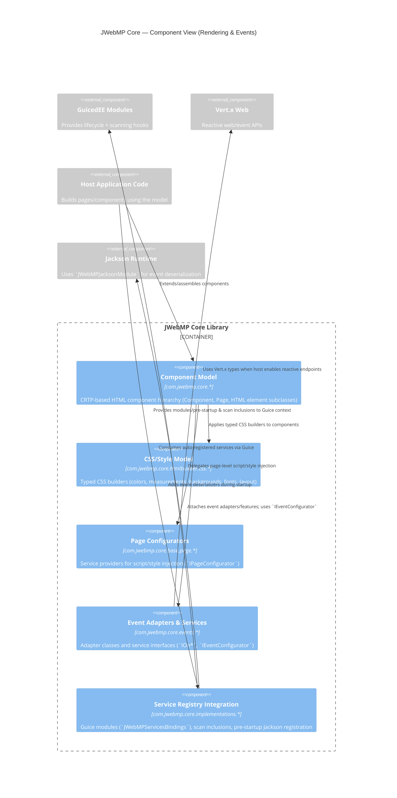

# C4 Model — Level 3 (Component: Rendering & Events)

Evidence
- Exports/uses/provides in `module-info.java` (component packages, event `uses` clauses, Guice bindings).
- Service provider declarations in `src/main/resources/META-INF/services`.
- Guice bindings + Jackson module under `com.jwebmp.core.implementations`.
- Event adapter classes under `src/main/java/com/jwebmp/core/events/*`.
