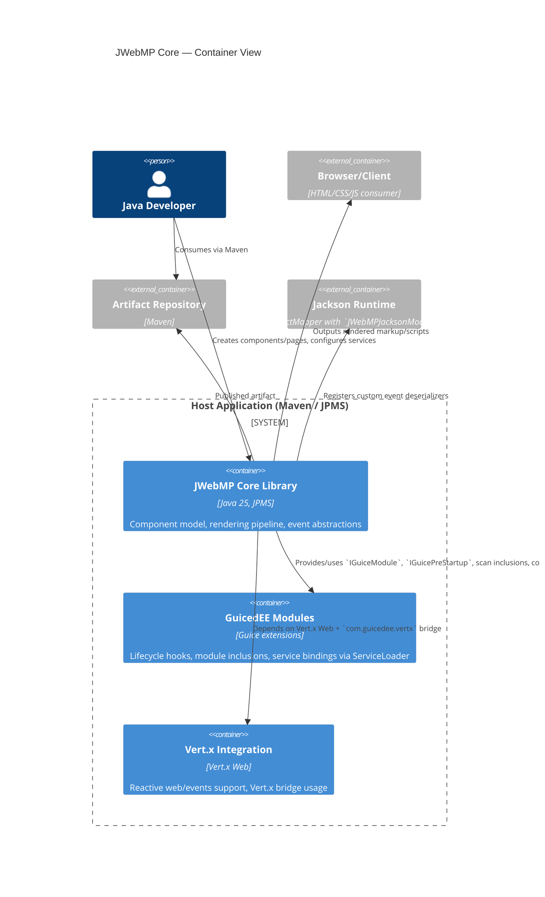

# C4 Model — Level 2 (Containers)

Evidence
- Dependencies in `pom.xml` (GuicedEE BOMs, Vert.x Web, Jackson, Apache Commons).
- `module-info.java` exports UI/component packages, uses event services, and provides Guice/scan bindings.
- Startup path in `JWebMPPreStartup` registers Jackson module; `JWebMPServicesBindings` wires configurator/service sets.
