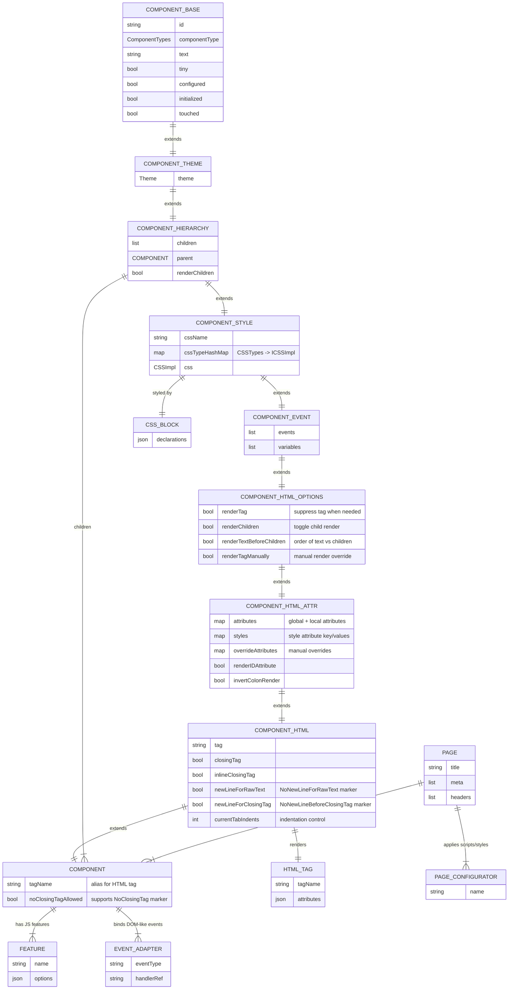

# ERD — Core UI Model (Component Hierarchy → HTML)

How this maps to HTML generation
- The CRTP chain starts at `ComponentBase` (IDs, component type, raw text), then adds themes, children, CSS, events, and finally HTML tag controls (`ComponentHTMLBase`, `ComponentStyleBase`, `ComponentEventBase`, `ComponentHierarchyBase`, `Component`).
- `ComponentHierarchyBase` manages parent/child relationships and render ordering, producing nested HTML nodes.
- `ComponentHTMLOptionsBase` toggles rendering of tag/children/text; `ComponentHTMLAttributeBase` composes global/local attributes, inline styles, and ID handling; `ComponentHTMLBase` controls tag name, closing behavior, inline rendering, and new-line preferences.
- `ComponentStyleBase` composes CSS via `CSSImpl` and `ICSSImpl` per `CSSTypes`; output becomes class attributes or inline styles.
- `ComponentEventBase` and event adapters (e.g., `ClickAdapter`) bind DOM-like events to server-side handlers; features emit supporting scripts.
- Pages (`Page`) are roots that aggregate components, headers, and configurators. Configurators (`IPageConfigurator`) are loaded via ServiceLoader (`JWebMPServicesBindings`) to inject scripts/styles before render.

Evidence
- Class chain observed in `ComponentBase`, `ComponentThemeBase`, `ComponentHierarchyBase`, `ComponentStyleBase`, `ComponentEventBase`, `ComponentHTMLBase`, `Component`.
- Service providers for configurators and events in `src/main/resources/META-INF/services`; Guice bindings in `com.jwebmp.core.implementations`.
- CSS builders under `com.jwebmp.core.htmlbuilder.css.*`; event adapters under `com.jwebmp.core.events.*`.
