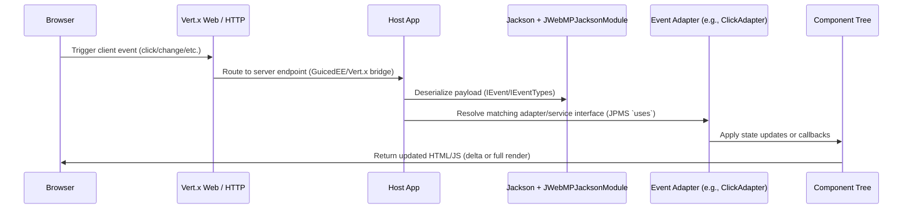

# Sequence — Event Handling (Server-Side Adapter)

Notes
- Event adapters are listed under `com.jwebmp.core.events.*`; service interfaces are consumed via JPMS `uses` entries and ServiceLoader.
- Exact transport (AJAX vs Vert.x websockets) is host-app defined; this diagram reflects the common server-side flow.
