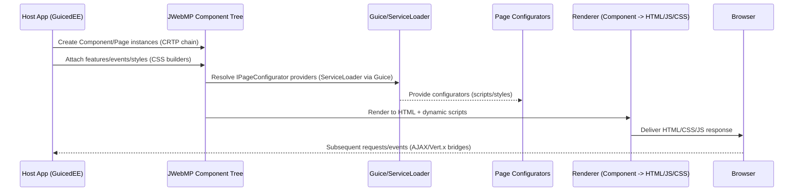

# Sequence - Page Rendering Pipeline

How rendering is built
- `ComponentHTMLBase` is the minimal layer that can emit a tag: it owns the tag name, closing vs inline flags, and whether raw text renders before or after children. Without it, nothing reaches the client even for a bare `<tag></tag>`.
- `ComponentHierarchyBase` is the class that most implementations extend; it wires `parent/children`, toggles `renderChildren`, and overrides `renderHTML(int tabCount)` to fire `IOnComponentHtmlRender` hooks before delegating to the HTML base to draw tags and recurse.
- Attribute/style/event layers sit above the HTML base: `ComponentHTMLAttributeBase` merges attributes/styles, `ComponentEventBase` carries events/variables, `ComponentStyleBase` composes CSS via builders, and `ComponentThemeBase` injects themes.

Render path (step-by-step)
0) API entry point: call `component.toString(true)` on any `ComponentHierarchyBase` (often the `Page` root, but any subtree works) to render HTML (and queue JS) for that portion of the tree.
1) Host code builds a `Page` (root) and attaches components/features/events using the CRTP setters (e.g., `new Div().add(new Span())`).
2) The root calls `renderHTML(...)`; `ComponentHierarchyBase` preconfigures closing tags, triggers `IOnComponentHtmlRender` providers (ServiceLoader), sets `renderChildren`, and then delegates to the HTML layer.
3) `ComponentHTMLBase` writes the opening tag/options, raw text, children (via the hierarchy), and closing tag depending on `renderTag`, `closingTag`, and `inlineClosingTag`.
4) After HTML, `renderJavascriptAll()` in `ComponentHierarchyBase` aggregates queries and feature/event scripts to append to the response; page configurators (loaded via `JWebMPServicesBindings` from `META-INF/services`) inject static or dynamic assets around the markup.
5) Subsequent AJAX/Vert.x calls re-enter the same pipeline starting at the component being updated, so the hierarchy + HTML bases remain the decisive layers for what is emitted.

Evidence
- `ComponentHierarchyBase.renderHTML` drives hooks and recursion; it also aggregates scripts in `renderJavascriptAll()` (`src/main/java/com/jwebmp/core/base/ComponentHierarchyBase.java`).
- Tag-only rendering and closing/inline logic live in `ComponentHTMLBase` (`src/main/java/com/jwebmp/core/base/ComponentHTMLBase.java`).
- Configurator loading is handled by `JWebMPServicesBindings` and `IPageConfigurator` providers under `src/main/resources/META-INF/services`.
